# YahrShell - Yet Another Hyprland Rice 🍚

Complete Arch Linux desktop environment featuring Hyprland + Quickshell with unified theme system and comprehensive automated installation.

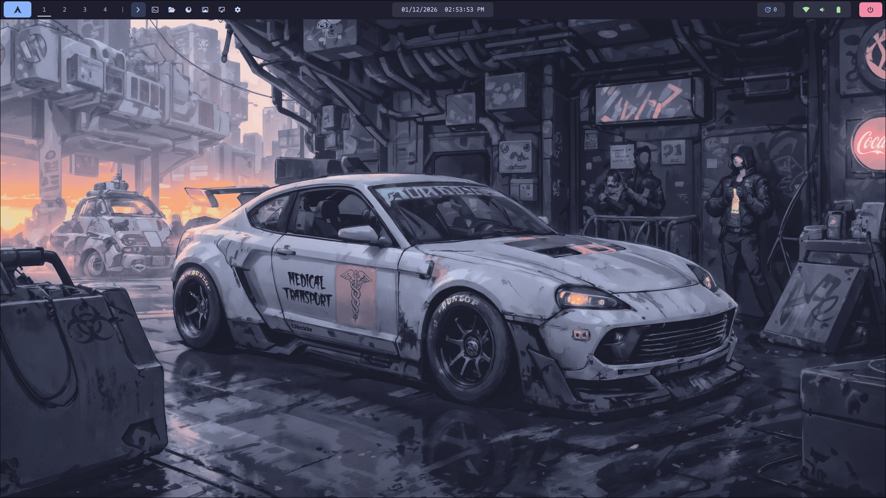

## ✨ Features
- 🎨 **13 Beautiful Themes** - Instant switching across all applications
- 🖥️ **Quickshell Desktop** - Modern QML-based desktop environment with glass/liquid glass UI
- 🪟 **Glassmorphism UI** - Semi-transparent panels, frosted glass cards, and gradient borders throughout
- ⚡ **Unified Theme System** - Synced themes for Hyprland, GTK, Kitty, Firefox, VSCodium, Discord, and more
- 🎯 **GPU-Aware Installation** - Auto-detects and installs appropriate drivers (NVIDIA/AMD/Intel/Hybrid)
- 🚀 **Fully Automated Installer** - One command from minimal Arch to complete desktop
- 🎭 **Icon Theme Integration** - Papirus icons with dynamic folder colors matching your theme
- 📦 **Complete Graphics Stack** - Wayland, Mesa, Vulkan, Qt5/Qt6 support
- 🔧 **Two Installation Modes** - Full (all features) or Minimal (core only)
- ⚙️ **YOLO Mode** - Completely unattended installation option
- 🕐 **Flexible Date & Clock Formats** - Toggle 12/24hr, MM/DD/YYYY vs DD/MM/YYYY, numeric or long date, optional day-of-week
- 🖼️ **Smart Wallpaper Picker** - Browse theme-matched or all wallpapers; persists across reboots
- 🔒 **Synced Login Screen** - SDDM and Hyprlock date format follows your Settings choices automatically

## 📋 Prerequisites

**All you need is a minimal Arch Linux installation!**

The installer handles everything else:
- ✅ GPU driver detection and installation (NVIDIA/AMD/Intel/Hybrid)
- ✅ AUR helper installation (yay/paru)
- ✅ Complete graphics stack (Wayland, Mesa, Vulkan, Qt)
- ✅ All dependencies and recommended packages
- ✅ Quickshell, Hyprland, and all desktop components
- ✅ Theme system and configurations

### Minimum Requirements
- Fresh or existing Arch Linux installation
- Internet connection
- `git` installed (`sudo pacman -S git`)

That's it! The installer does the rest.

## 🚀 Quick Installation

```bash
# Clone the repository
git clone https://github.com/bgibson72/yahr-quickshell.git
cd yahr-quickshell

# Run the installer
./install.sh
```

### Installation Modes

**Normal Mode (Recommended for first-time users)**
- Interactive prompts for optional components
- Choose AUR helper (yay/paru)
- Select NVIDIA driver type (proprietary/nouveau)
- Optional: Neovim, Vesktop, VSCodium, Thunar, Firefox, SDDM

**YOLO Mode (Unattended)**
- Fully automated, zero prompts
- Auto-installs yay as AUR helper
- Auto-selects proprietary NVIDIA drivers
- Skips all optional components (including SDDM)
- Perfect for scripted/VM installations
- No sudoers files created (only core system modifications)

**Installation Types**
- **Full Install**: All core components + optional applications (recommended)
- **Minimal Install**: Core desktop only (Quickshell, Hyprland, Kitty, Mako)

## 🎯 What Gets Installed

### Core Components (Always Installed)
- **Quickshell** - Desktop environment framework
- **Hyprland** - Wayland compositor with complete configuration
- **GPU Drivers** - Auto-detected for your hardware
  - NVIDIA: nvidia-dkms, nvidia-utils (with proper env vars)
  - AMD: vulkan-radeon, mesa-vdpau, amdgpu
  - Intel: vulkan-intel, libva-intel-driver, intel-media-driver
  - Hybrid: All detected GPUs + envycontrol for switching
- **Graphics Stack**
  - Mesa, Wayland, XWayland
  - Qt5/Qt6 Wayland support
  - Vulkan, libinput, seatd, polkit
- **Kitty** - Terminal emulator with theme sync
- **Mako** - Notification daemon
- **Wofi** - Application launcher and clipboard history GUI
- **Cliphist** - Clipboard history manager (requires wofi for GUI)
- **Wallpapers** - Collection organized by theme
- **Papirus Icons** - With dynamic folder colors
- **Fonts** - Maple Mono Nerd Font family, Nerd Fonts Symbols
- **Starship** - Shell prompt with configuration

### Recommended Packages (Auto-Installed)
- **Audio**: PipeWire, WirePlumber, pavucontrol
- **Bluetooth**: Blueman
- **Network**: NetworkManager
- **Utilities**: Thunar, Firefox, brightnessctl
- **Screenshots**: hyprshot, grim, slurp
- **Clipboard**: cliphist for clipboard history management
- **Tools**: nwg-look (GTK theme manager)
- **System Info**: fastfetch with themed logos
- **Fonts**: Noto Color Emoji for colored icons

### Optional Components (Full Install - User Choice)
- **Neovim** - Editor with AstroVim configuration and 10 synced colorschemes
- **Vesktop** - Discord client with Vencord theme support
- **VSCodium** - VS Code alternative with theme integration
- **Thunar** - File manager with thumbnail support and custom plugins
- **Firefox** - Browser with userChrome.css theming
- **SDDM** - Display manager (login screen) with theme
  - **Note**: Installing SDDM creates a sudoers rule (`/etc/sudoers.d/sddm-sync-yahr`) to allow passwordless theme synchronization. This only grants permission for the sync script to update SDDM theme files. You can skip SDDM installation if you prefer not to have this file created.
- **Pacseek** - Modern TUI package manager with CLI launcher support

## 🎨 Included Themes
Switch themes instantly with Super + T. All themes include matching wallpapers and synchronized colors across all applications.

<details>
<summary><b>Catppuccin (Mocha) - Default Theme</b></summary>

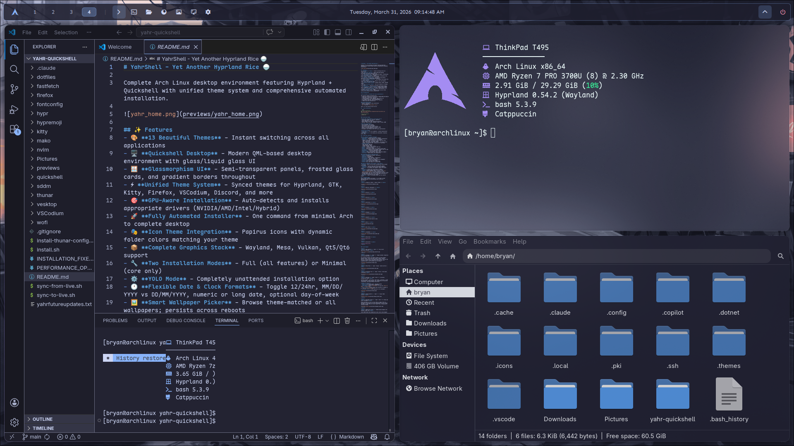
</details>

<details>
<summary><b>Material (Palenight)</b></summary>

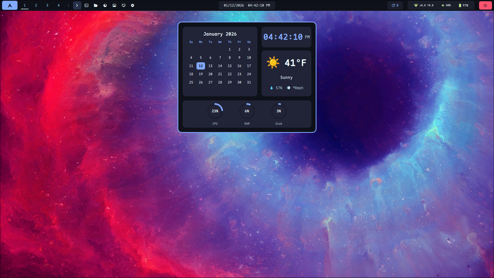
</details>

<details>
<summary><b>Dracula</b></summary>

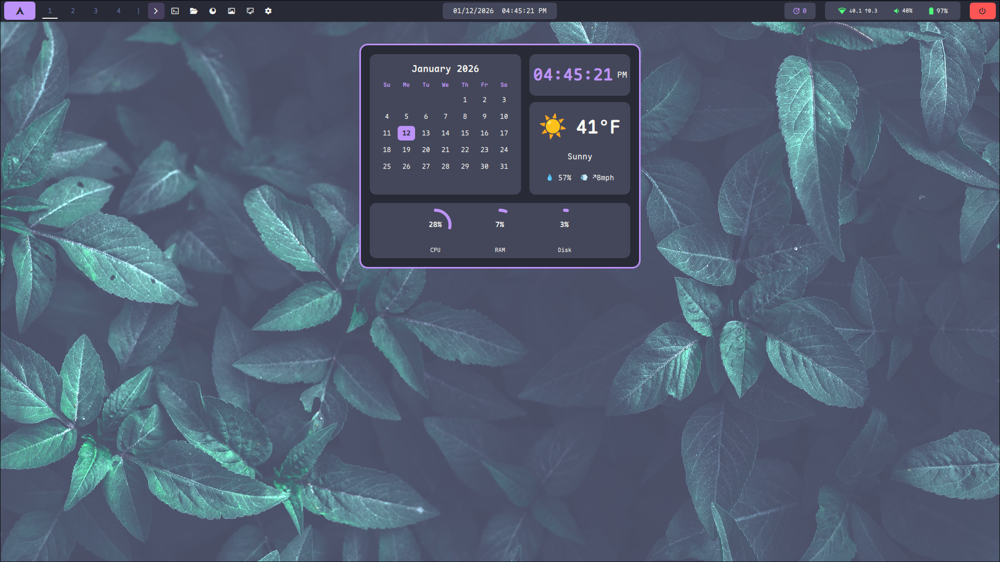
</details>

<details>
<summary><b>Eldritch</b></summary>

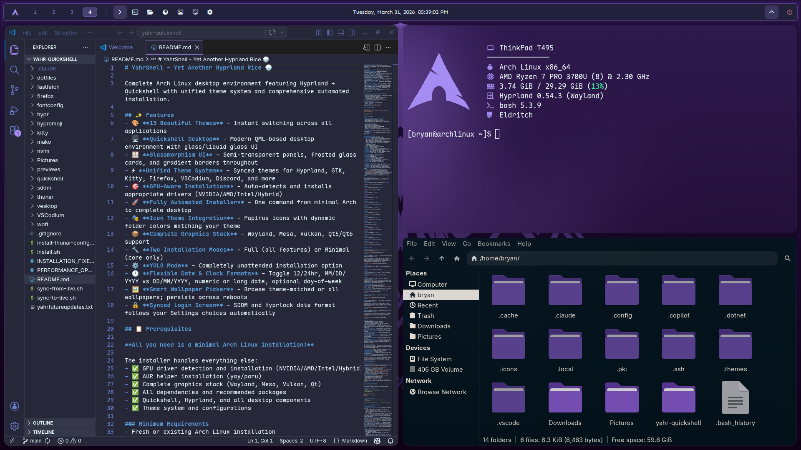
</details>

<details>
<summary><b>Everforest</b></summary>

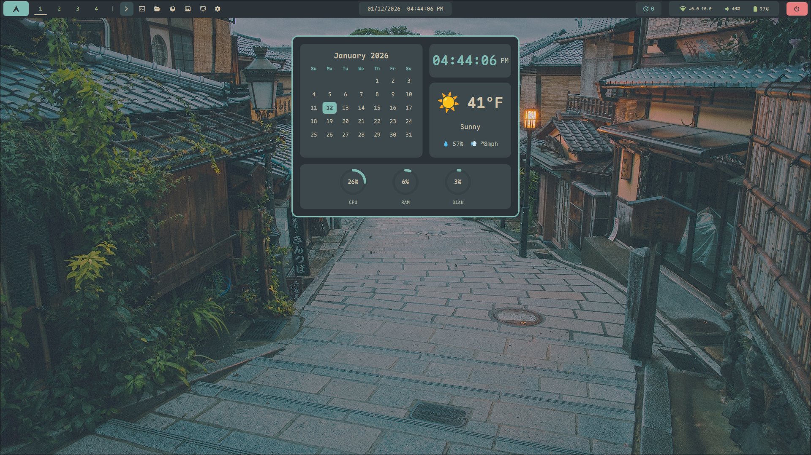
</details>

<details>
<summary><b>Gruvbox</b></summary>

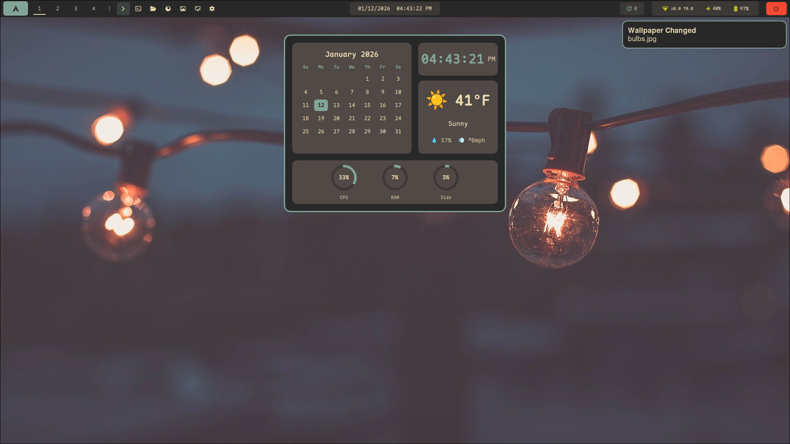
</details>

<details>
<summary><b>Kanagawa</b></summary>

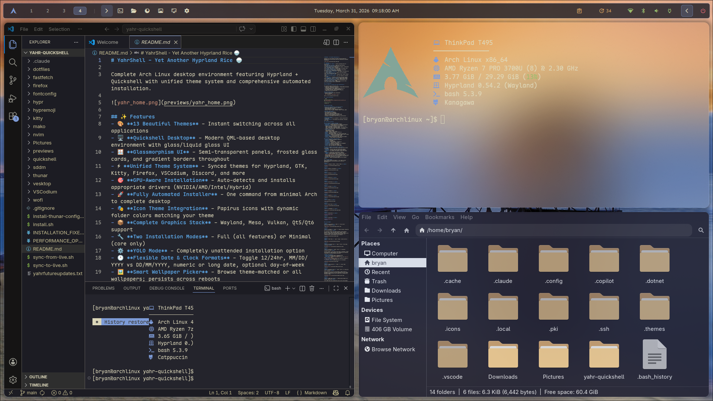
</details>

<details>
<summary><b>NightFox</b></summary>

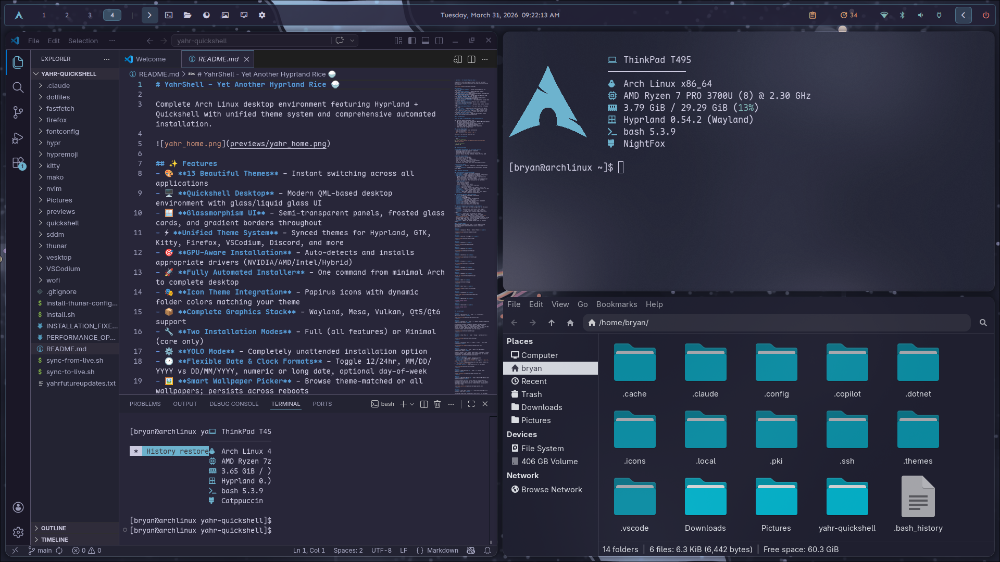
</details>

<details>
<summary><b>Nord</b></summary>

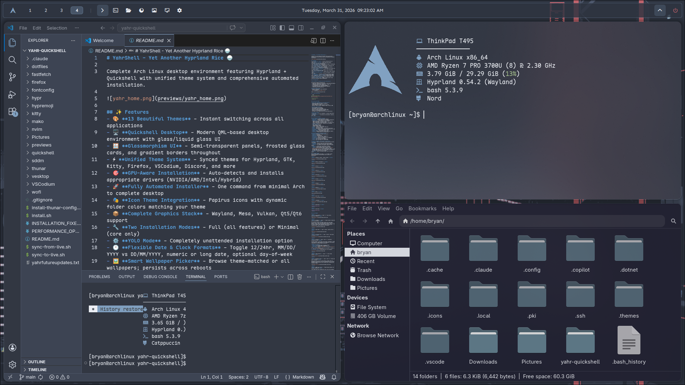
</details>

<details>
<summary><b>Rosé Pine</b></summary>

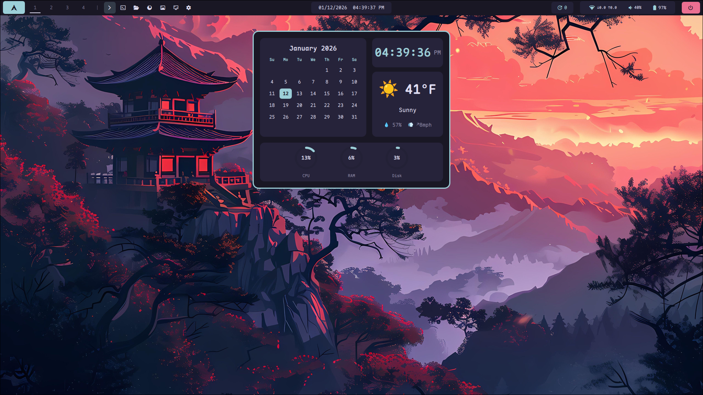
</details>

<details>
<summary><b>TokyoNight</b></summary>

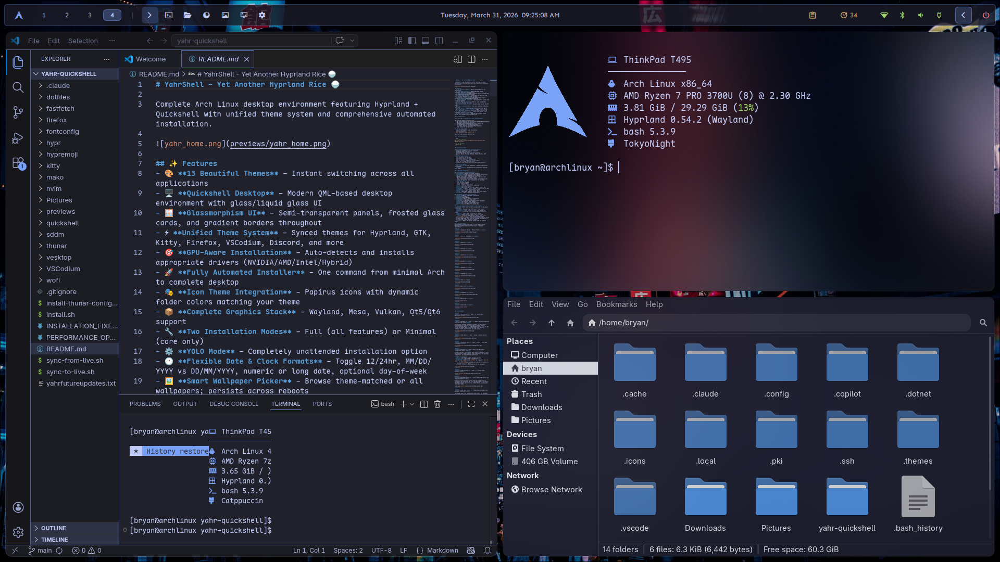
</details>

<details>
<summary><b>Monochrome</b></summary>

*(preview coming soon)*
</details>

<details>
<summary><b>Solarized</b></summary>

*(preview coming soon)*
</details>


### Custom Widgets

<details>
<summary><b>App Launcher</b> - Super + A - Fuzzy search application launcher</summary>


</details>

<details>
<summary><b>Calendar</b> - Super + C - Google Calendar integration with recurring events</summary>

Full-featured calendar with Google Calendar iCal URL support. Displays events, recurring events (daily, weekly, monthly, yearly), all-day events, and timezone-aware events. Click any day to view its events. Event indicators show which days have scheduled events. Auto-refreshes every 15 minutes.


</details>

<details>
<summary><b>Power Menu</b> - Super + Escape - System controls</summary>


</details>

<details>
<summary><b>Screenshot Tool</b> - Super + PrtScrn - Multi-mode screenshots</summary>


</details>

<details>
<summary><b>Settings</b> - Super + Shift + S - Quickshell configuration panel</summary>

Configure weather, clock format, date format, screenshots, system tray visibility, theme selection, bar transparency, bar position (top/bottom), and Sip-StartPage installation.

**Widgets tab options:**
- **Clock** — 12/24-hour format, show/hide seconds
- **Date format** — MM/DD/YYYY or DD/MM/YYYY
- **Long date** — numeric (`03/27/2026`) or long form (`March 27, 2026` / `27 March 2026`)
- **Day of week** — prepend weekday when long date is enabled (e.g. `Wednesday, March 27, 2026`)
- **Wallpaper picker** — show theme-only or all wallpapers


</details>

<details>
<summary><b>Theme Switcher</b> - Super + T - Visual theme selector</summary>


</details>

<details>
<summary><b>Wallpaper Picker</b> - Super + Shift + W - Browse and select wallpapers</summary>

Browse wallpapers for your current theme or toggle "Show all wallpapers" in Settings to see every wallpaper across all themes. Selected wallpaper persists across reboots and is automatically restored on login.


</details>

<details>
<summary><b>SDDM Login Screen</b> - Themed display manager with automatic theme sync</summary>

Custom SDDM theme that automatically syncs colors and wallpaper with your selected theme. Test without logging out using: `sddm-greeter-qt6 --test-mode --theme /usr/share/sddm/themes/yahr-theme`


</details>


### System Integration
- Workspace management with visual indicators
- System tray with audio, network, and updates
- Notification system with glass styling: semi-transparent background, thin accent border, and compositor blur
- GTK theme synchronization
- **Glass/Liquid Glass UI** - All widgets use semi-transparent panels, frosted glass cards, specular highlights, and smooth hover transitions
- **Glass window borders** - Hyprland borders use a 45° gradient (dark shadow → theme accent → white specular), adapting to each theme
- **Configurable bar position** - Toggle between top and bottom placement
- **SDDM theme synchronization** - Login screen automatically syncs with system theme
- **Firefox theme synchronization** - Automatic Firefox UI theming via userChrome.css
- **Neovim theme synchronization** - AstroVim colorschemes sync with system theme
- **Fastfetch themed display** - System info with matching logo and colors
- **CLI app launcher support** - Terminal apps launch correctly from app launcher
- **Included GTK themes and icons** - Multiple theme-matched GTK themes and icon packs included in quickshell/gtk-themes/ and quickshell/gtk-icons/

## Hyprland Configuration

The Hyprland configuration is modularized for easier maintenance and customization. Instead of one monolithic config file, settings are organized into separate files:

- **monitors.conf** - Display configuration and monitor settings
- **programs.conf** - Default application definitions
- **autostart.conf** - Programs to launch at startup
- **variables.conf** - Environment variables
- **look-and-feel.conf** - Appearance, animations, layouts, and window decorations
- **input.conf** - Keyboard, mouse, touchpad, and gesture settings
- **keybinds.conf** - All keyboard shortcuts and bindings
- **rules.conf** - Window and workspace rules

The main `hyprland.conf` file sources all these modules, keeping it clean and organized. Edit individual files in `hypr/` to customize specific aspects of your setup without navigating through a large config file.

## Security & Permissions

### Sudoers Configuration

The installer may create sudoers files for specific features (only with your permission during interactive installation):

**SDDM Theme Sync** (`/etc/sudoers.d/sddm-sync-yahr`)
- Created only if you choose to install SDDM
- Allows passwordless theme synchronization to SDDM login screen
- Grants limited permissions:
  - Copy wallpapers to `/usr/share/sddm/themes/yahr-theme/`
  - Update `/usr/share/sddm/themes/yahr-theme/theme.conf`
- Restricted to users in the `wheel` group
- You can manually remove this file if you prefer entering a password for SDDM theme updates

**Papirus Folder Colors** (`/etc/sudoers.d/papirus-folders`)
- Installed automatically with Papirus icons
- Allows passwordless folder color changes
- Single command: `/usr/bin/papirus-folders`

Both files follow security best practices with minimal, specific permissions. You can review or remove them at any time from `/etc/sudoers.d/`.

## Development & Customization

### Bidirectional Sync Scripts

For developers and power users who want to modify configs:

**Working with Live Configs:**
```bash
# Make changes directly in ~/.config/
# When ready to commit, sync changes back to repo:
./sync-from-live.sh

# Then commit and push:
git add -A
git commit -m "Your changes"
git push
```

**Testing Repo Changes:**
```bash
# Made changes in the repo? Test them in live config:
./sync-to-live.sh

# Restart affected applications (e.g., quickshell --replace &)
```

### Key Features & Recent Improvements

**Latest Updates (v1.5)**
- **Flexible Date Format Controls** - New Widgets tab options in Settings:
  - Toggle between MM/DD/YYYY and DD/MM/YYYY layouts
  - Switch between numeric date (`03/27/2026`) and long-form (`March 27, 2026` or `27 March 2026`)
  - Optional day-of-week prefix on long format (e.g. `Wednesday, March 27, 2026`)
  - All three options dynamically update the bar clock in real time
- **SDDM & Hyprlock Date Sync** - `sync-sddm-theme.sh` and `sync-hyprlock-theme.sh` now read date format settings and apply the matching Qt/strftime format strings to the login and lock screens automatically
- **Wallpaper Picker Reliability** - Fixed race between daemon check and `awww img` call; wallpaper is now only applied after the daemon is confirmed running (or given 800 ms to start if it wasn't)
- **Wallpaper Persistence** - Last chosen wallpaper is saved to `~/.config/quickshell/last-wallpaper` and automatically restored on every login via `autostart.conf`
- **Correct Theme-Filtered Wallpapers** - Fixed a race condition where the picker could show wallpapers from a previous theme; settings and current-theme file are now loaded sequentially before the directory is resolved
- **awww wallpaper daemon support** - All wallpaper calls updated from `swww` → `awww`/`awww-daemon` to match the installed binary

**Previous Updates (v1.4)**
- **Glass/Liquid Glass UI Overhaul** - Complete redesign of all widgets with glassmorphism aesthetics
  - Semi-transparent panel backgrounds (92% opacity) with 1px accent borders at 35% alpha
  - Frosted glass cards with subtle white fill and border throughout
  - Specular top-highlight and bottom-fade gradient overlays on all panels
  - Smooth 150ms color transitions on all hover and active states
- **Glass Window Borders** - Hyprland borders now use a 45° diagonal gradient per theme
  - Dark shadow corner → theme accent color → white specular highlight
  - Subtle inactive borders with near-transparent white gradient
  - `$glass-accent-rgba` variable added to all 13 theme files
- **Glass Notification Styling** - Mako updated to match the glass design language
  - Semi-transparent background with thin accent border (urgency-aware)
  - Compositor blur via Hyprland layerrule
- **Consistent Close Buttons** - Unified glass close button style across all widgets
- **Sip-StartPage** - Personal startpage installer replaces Bento in Settings
- **AppLauncher Animation** - Refined slide-in from bounce to smooth cubic easing

**Previous Updates (v1.3)**
- **Google Calendar Integration** - Full iCal URL support with recurring events (RRULE)
  - Supports DAILY, WEEKLY, MONTHLY, and YEARLY recurring patterns
  - Handles BYDAY, UNTIL, INTERVAL, and COUNT parameters
  - UTC and timezone-aware event parsing
  - All-day event support
  - Click any day to view its events
  - Event indicators on calendar days
  - Auto-refresh every 15 minutes (configurable)
  - Parses 1000+ events efficiently with caching

**Previous Updates (v1.2)**
- **Bar Position Toggle** - Choose top or bottom bar placement in Settings
- **Neovim Theme Sync** - AstroVim colorschemes now sync with system theme
- **Enhanced Installer** - Improved package detection, theme initialization, and optional component prompts
- **Thunar Thumbnails** - Full thumbnail support with tumbler and media plugins
- **Colored Weather Icons** - Emoji support via fontconfig configuration
- **CLI App Launcher Support** - Terminal-based apps (like Pacseek) now launch correctly
- **Fastfetch Integration** - Themed logo display with kitty graphics protocol

**Update Counter (v1.1)**
- Checks both official repos AND AUR packages
- Handles pacman lock files properly
- Uses paru/yay for AUR updates
- Updates every hour with wake-from-sleep detection

**Theme Synchronization**
- **Neovim** - 10 colorscheme mappings (Catppuccin, Everforest, Kanagawa, Dracula, Eldritch, Gruvbox, Nightfox, Nord, RosePine, TokyoNight)
- **Firefox** - Auto-detect profile and generate userChrome.css from theme colors
- **VS Code/VSCodium** - Separate theme sync with workbench color customizations
- **Kitty** - Dynamic terminal theme switching
- **GTK** - Synchronized via gsettings and settings.ini
- **Papirus Icons** - Folder colors automatically match active theme
- **Starship** - Color-only updates preserving custom glyphs
- **Hyprlock** - Lock screen colors match active theme
- **Mako** - Notification glass styling (background, border color, and progress bar) adapts to active theme
- **Fastfetch** - Logo updates to match theme

## Contributing

Contributions, issues, and feature requests are welcome!

## Credits & Inspiration

### Core Technologies
- [Quickshell](https://github.com/outfoxxed/quickshell) by outfoxxed - Desktop environment framework
- [Hyprland](https://hyprland.org/) by [Vaxry](https://github.com/vaxerski) - Dynamic tiling Wayland compositor

### GTK Themes & Icons
- [Fausto Korpsvart](https://github.com/Fausto-Korpsvart) - GTK themes and icon packs
- [Dracula GTK](https://github.com/dracula/gtk) by [Eliver Lara](https://github.com/EliverLara) - Dracula theme

### Inspired By
- [HyDE Project](https://github.com/prasanthrangan/hyprdots) - Hyprland configuration
- [JaKooLit](https://github.com/JaKooLit) - Hyprland configuration
- [Stephan Raabe's ML4W](https://www.ml4w.com) - Hyprland configuration
- [end-4](https://github.com/end-4) - quickshell, ags and desktop concepts
- [Matt-FTW](https://github.com/Matt-FTW) - quickshell and hyprland configuration
- [Caelestia-dots](https://github.com/Heus-Sueh/Caelestia-dots) - Beautiful quickshell configuration
- And many others in the r/unixporn and Hyprland communities

---

**Made with ❤️ for the Arch + Hyprland community**
