# YAHR - Yet Another Hyprland Rice 🍚

Complete Arch Linux + Hyprland desktop configuration with unified theme system.

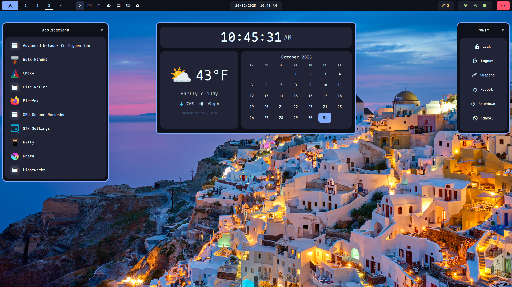

## Features
- 🎨 11 beautiful themes with instant switching
- 🖥️ Quickshell desktop environment
- ⚡ Synced themes across all apps
- 📦 Ready to use configurations
- 🎭 Includes GTK themes and icon packs

## Prerequisites

### System Requirements
- Linux distribution with Hyprland support (Arch Linux recommended)
- Preinstalled Hyprland window manager
- git (for cloning this repository)
- base-devel (for building packages)

### AUR Helper (Arch Linux)
Many packages are installed from the AUR. You'll need an AUR helper like `yay`:
```bash
# Install yay if you don't have it
sudo pacman -S --needed git base-devel
git clone https://aur.archlinux.org/yay.git
cd yay
makepkg -si
```
If you prefer `paru` or another AUR helper, substitute `yay` with your preferred tool in the installation commands below.

## Requirements

### Absolute Minimum Requirements
These packages are **required** for basic functionality:
```bash
# Core system (must be pre-installed)
# - hyprland - Wayland compositor
# - git - For cloning this repository
# - base-devel - For building AUR packages

# Desktop environment and shell
yay -S quickshell-git              # Main desktop environment framework
sudo pacman -S kitty               # Terminal emulator (used throughout)

# Wallpaper and notifications
sudo pacman -S swww                # Wallpaper daemon
sudo pacman -S mako                # Notification daemon
sudo pacman -S libnotify           # Provides notify-send command

# Authentication and security
sudo pacman -S hyprpolkitagent     # Polkit authentication agent

# Screenshots
sudo pacman -S hyprshot            # Screenshot utility
sudo pacman -S grim slurp          # Screenshot dependencies

# Audio system (PipeWire/PulseAudio)
sudo pacman -S wireplumber pipewire-pulse  # Or: pulseaudio pulseaudio-alsa
sudo pacman -S pavucontrol         # Volume control GUI (system tray)

# GTK theme system
yay -S nwg-look                    # GTK theme/icon manager (REQUIRED)

# Network management
sudo pacman -S networkmanager      # Network backend
# nmtui is included with networkmanager
```

### Required Fonts
The bar and widgets **will not display correctly** without these fonts:
```bash
# Nerd Fonts Symbols - Required for all icons in the bar and widgets
sudo pacman -S ttf-nerd-fonts-symbols ttf-nerd-fonts-symbols-common

# Maple Mono Nerd Font - Required for text in bar, workspaces, and widgets
yay -S ttf-maple                   # Or: maplemono-nf-unhinted
```

### Strongly Recommended
These packages enable core features and widgets:
```bash
# Bluetooth (for system tray icon)
sudo pacman -S bluez bluez-utils blueman

# File manager (launched by Files button in bar)
sudo pacman -S thunar

# Browser (Super + B keybind)
sudo pacman -S firefox

# Brightness control (for brightness keys on laptops)
sudo pacman -S brightnessctl

# Power management (for battery system tray icon)
sudo pacman -S xfce4-power-manager  # Or: gnome-power-manager

# Screen locking and idle management
sudo pacman -S hyprlock hypridle

# Emoji picker (Hypremoji - if you want emoji selector)
yay -S hypremoji
```

### Application Suite (Optional)
These are the applications pre-configured with theme support:
```bash
# Code editors
yay -S vscodium-bin                # VS Code fork (theme support included)
sudo pacman -S neovim              # Terminal editor (AstroNvim config)

# Communication
yay -S vesktop-bin                 # Discord client (Vencord theme support)

# System tools
sudo pacman -S htop                # System monitor
```

### Thunar File Manager Enhancements
To enable image/video thumbnails and additional file support:
```bash
# Core thumbnail service for Thunar
sudo pacman -S tumbler ffmpegthumbnailer

# Additional format support (optional)
sudo pacman -S poppler-glib libgsf  # PDF and ODF thumbnails

# Archive support
sudo pacman -S thunar-archive-plugin file-roller

# Mount support for USB drives, etc.
sudo pacman -S gvfs thunar-volman
```
Restart Thunar after installation for thumbnails and features to appear.

## Installation

### 1. Install All Required Packages
Follow the package installation instructions in the **Requirements** section above. At minimum, you must install the packages listed under "Absolute Minimum Requirements" and "Required Fonts".

###  2. Clone and Install Configurations
```bash
git clone https://github.com/bgibson72/yahr-quickshell.git
cd yahr-quickshell

# Backup existing configs (recommended)
mkdir -p ~/config-backup
cp -r ~/.config/{hypr,kitty,quickshell,mako,nvim,vesktop,VSCodium} ~/config-backup/ 2>/dev/null || true

# Install configurations
cp -r hypr kitty mako nvim vesktop VSCodium ~/.config/

# Install quickshell configuration
# Note: This copies all files including shell.qml, scripts, themes, and executables
cp -r quickshell ~/.config/

# Install GTK themes and icons
mkdir -p ~/.themes ~/.icons
cp -r quickshell/gtk-themes/* ~/.themes/
cp -r quickshell/gtk-icons/* ~/.icons/
```

### 3. Configure Hyprland Autostart
Add quickshell to your Hyprland configuration:
```bash
# Add quickshell to autostart
echo 'exec-once = quickshell' >> ~/.config/hypr/hyprland.conf

# If you're migrating from Waybar, remove it from autostart
sed -i '/exec-once.*waybar/d' ~/.config/hypr/hyprland.conf
```

### 4. Start Quickshell
```bash
# Test quickshell (should launch without errors)
quickshell

# Or restart Hyprland to start everything fresh
# Log out and log back in, or press Super + Shift + E (if configured)
```

### Troubleshooting
  - If `quickshell` can't find the config, ensure `~/.config/quickshell/shell.qml` exists
  - For widget issues, check that all scripts in `~/.config/quickshell/` are executable: `chmod +x ~/.config/quickshell/*.sh ~/.config/quickshell/toggle-*`
  - Check logs: `cat /run/user/$(id -u)/quickshell/by-id/*/log.qslog`

## Included Applications

- **hypr** - Hyprland window manager with 11 theme definitions
- **quickshell** - Custom desktop environment (bar, widgets, controls)
- **kitty** - Terminal emulator with theme synchronization
- **mako** - Notification daemon with themed styling
- **nvim** - Neovim with AstroNvim configuration
- **VSCodium** - VS Code fork with theme integration
  - **Note**: If you prefer Microsoft's VS Code, you can adapt the theme sync by changing the path in `sync-vscodium-theme.sh` from `~/.config/VSCodium/User/settings.json` to `~/.config/Code/User/settings.json`
- **vesktop** - Discord client with theme support

## Key Features

### Unified Theme System
Switch themes instantly across all applications with Super + T. Available themes:

<details>
<summary><b>Material (Palenight)</b></summary>

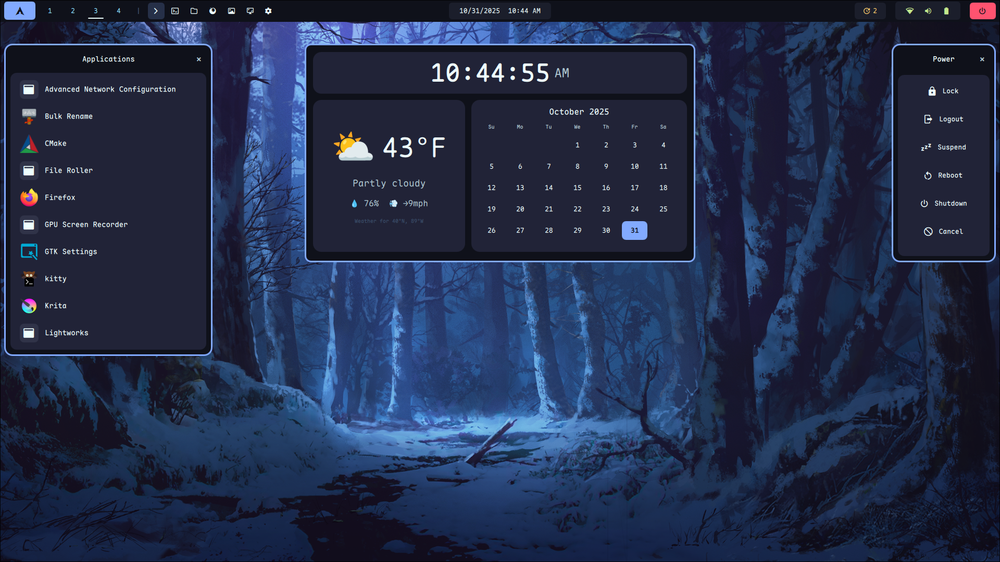
</details>

<details>
<summary><b>Catppuccin (Mocha)</b></summary>

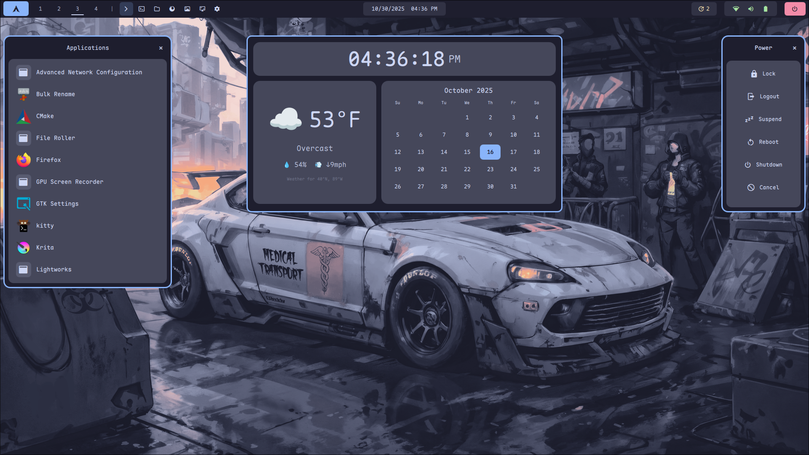
</details>

<details>
<summary><b>Dracula</b></summary>

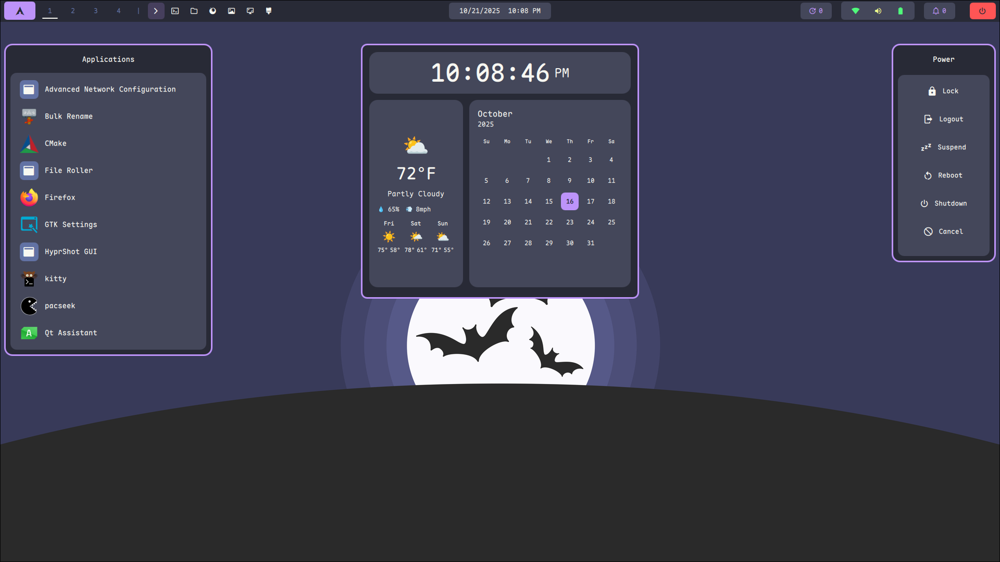
</details>

<details>
<summary><b>Eldritch</b></summary>

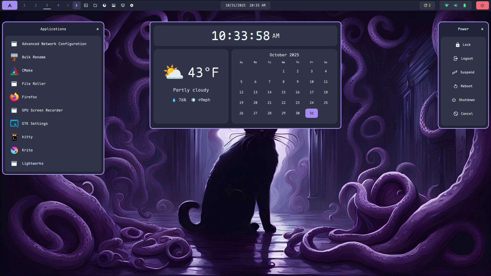
</details>

<details>
<summary><b>Everforest</b></summary>

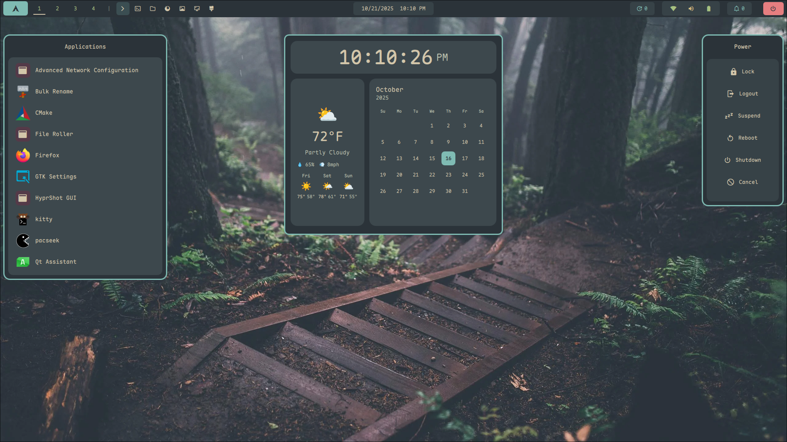
</details>

<details>
<summary><b>Gruvbox</b></summary>

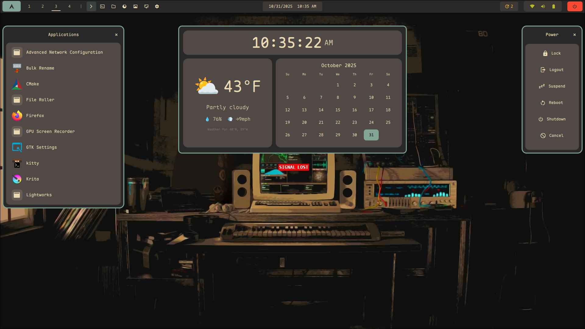
</details>

<details>
<summary><b>Kanagawa</b></summary>

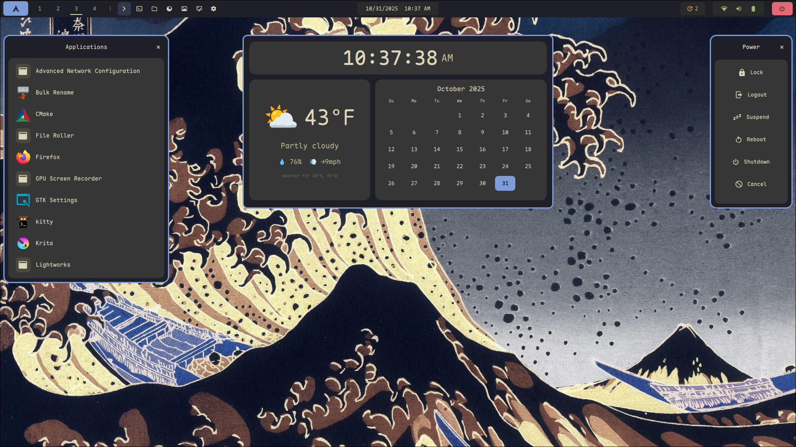
</details>

<details>
<summary><b>NightFox</b></summary>

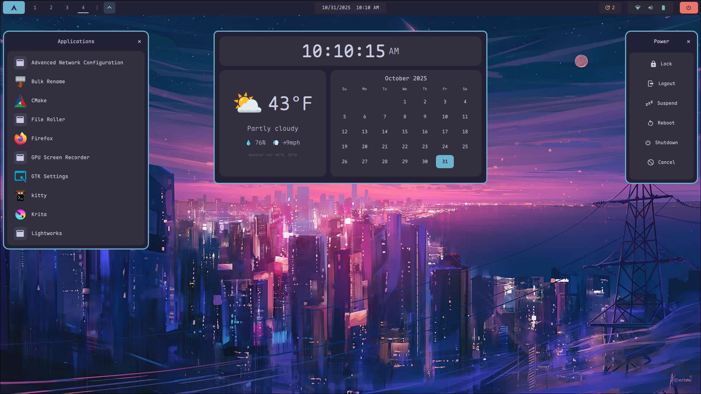
</details>

<details>
<summary><b>Nord</b></summary>

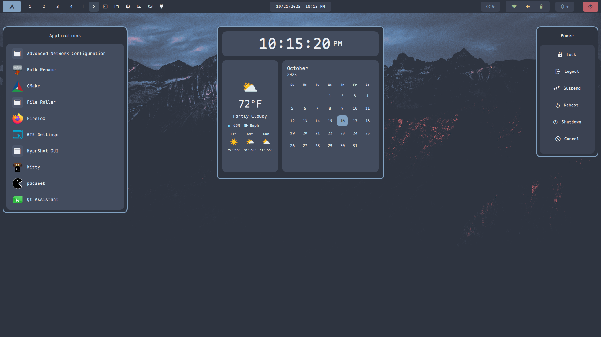
</details>

<details>
<summary><b>Rosé Pine</b></summary>

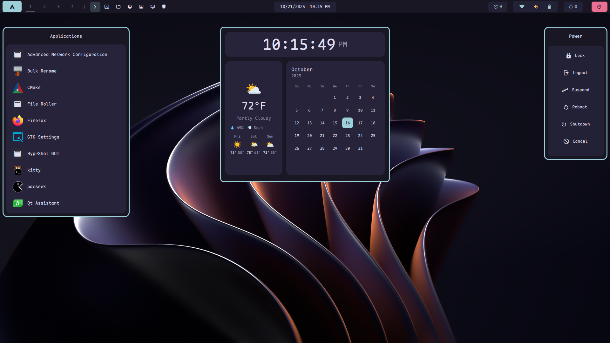
</details>

<details>
<summary><b>TokyoNight</b></summary>

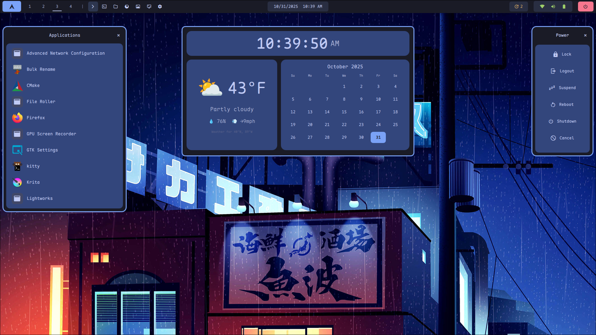
</details>


### Custom Widgets

<details>
<summary><b>App Launcher</b> - Super + A - Fuzzy search application launcher</summary>

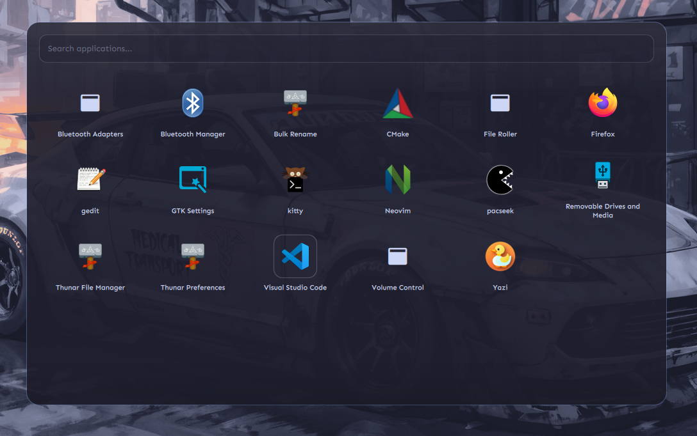
</details>

<details>
<summary><b>Calendar</b> - Super + C - Monthly calendar widget</summary>

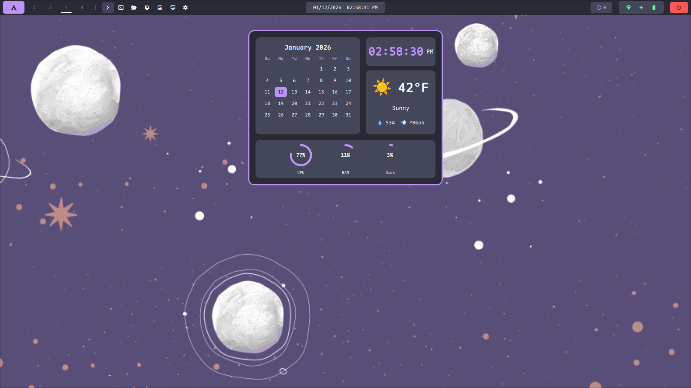
</details>

<details>
<summary><b>Power Menu</b> - Super + Escape - System controls</summary>

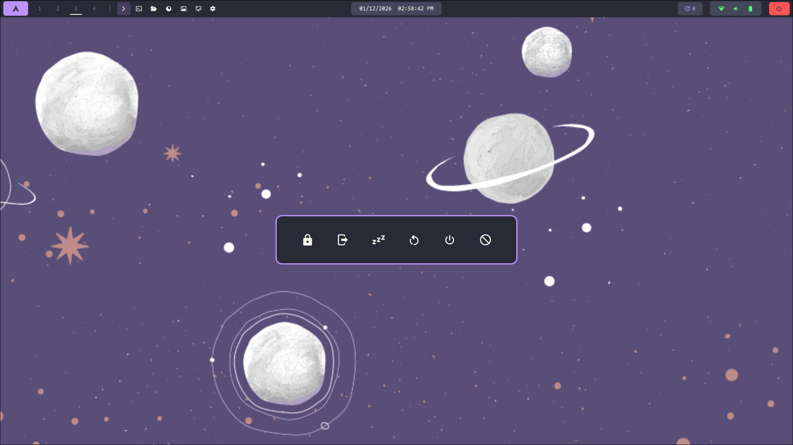
</details>

<details>
<summary><b>Screenshot Tool</b> - Super + PrtScrn - Multi-mode screenshots</summary>

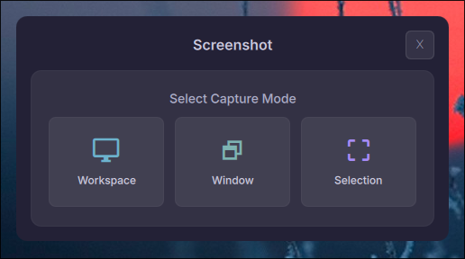
</details>

<details>
<summary><b>Settings</b> - Super + Shift + S - Quickshell configuration panel</summary>

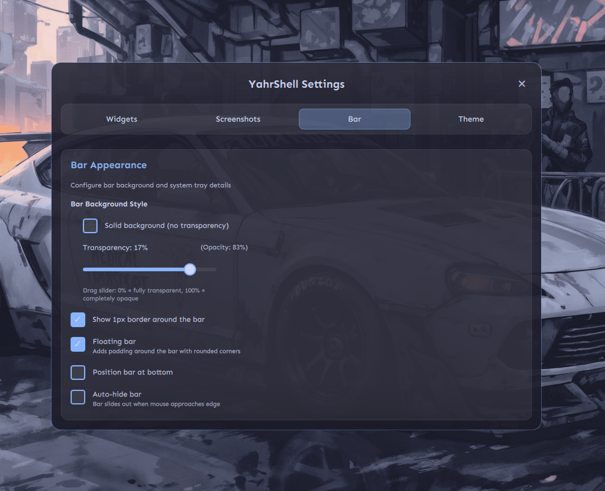
</details>

<details>
<summary><b>Theme Switcher</b> - Super + T - Visual theme selector</summary>

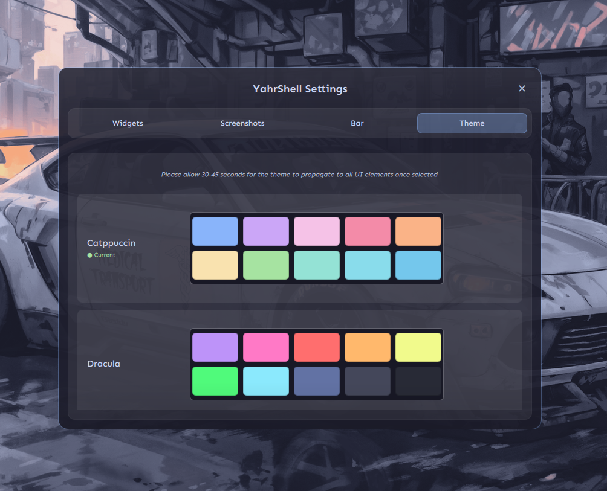
</details>

<details>
<summary><b>Wallpaper Picker</b> - Super + Shift + W - Browse and select wallpapers</summary>

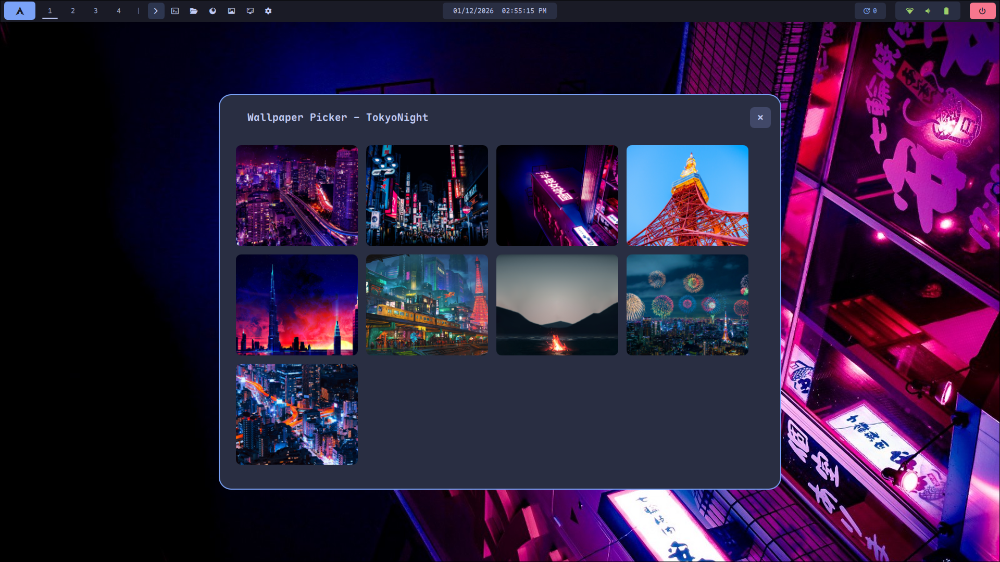
</details>


### System Integration
- Workspace management with visual indicators
- System tray with audio, network, and updates
- Notification system with urgency-based styling
- GTK theme synchronization
- **Included GTK themes and icons** - Multiple theme-matched GTK themes and icon packs included in quickshell/gtk-themes/ and quickshell/gtk-icons/

## Hyprland Configuration

The Hyprland configuration is modularized for easier maintenance and customization. Instead of one monolithic config file, settings are organized into separate files:

- **monitors.conf** - Display configuration and monitor settings
- **programs.conf** - Default application definitions
- **autostart.conf** - Programs to launch at startup
- **variables.conf** - Environment variables
- **look-and-feel.conf** - Appearance, animations, layouts, and window decorations
- **input.conf** - Keyboard, mouse, touchpad, and gesture settings
- **keybinds.conf** - All keyboard shortcuts and bindings
- **rules.conf** - Window and workspace rules

The main `hyprland.conf` file sources all these modules, keeping it clean and organized. Edit individual files in `hypr/` to customize specific aspects of your setup without navigating through a large config file.

## Contributing

Contributions, issues, and feature requests are welcome!

## Credits & Inspiration

### Core Technologies
- [Quickshell](https://github.com/outfoxxed/quickshell) by outfoxxed - Desktop environment framework
- [Hyprland](https://hyprland.org/) by [Vaxry](https://github.com/vaxerski) - Dynamic tiling Wayland compositor

### GTK Themes & Icons
- [Fausto Korpsvart](https://github.com/Fausto-Korpsvart) - GTK themes and icon packs
- [Dracula GTK](https://github.com/dracula/gtk) by [Eliver Lara](https://github.com/EliverLara) - Dracula theme

### Inspired By
- [HyDE Project](https://github.com/prasanthrangan/hyprdots) - Hyprland configuration
- [JaKooLit](https://github.com/JaKooLit) - Hyprland configuration
- [Stephan Raabe's ML4W](https://www.ml4w.com) - Hyprland configuration
- [end-4](https://github.com/end-4) - quickshell, ags and desktop concepts
- [Matt-FTW](https://github.com/Matt-FTW) - quickshell and hyprland configuration
- [Caelestia-dots](https://github.com/Heus-Sueh/Caelestia-dots) - Beautiful quickshell configuration
- And many others in the r/unixporn and Hyprland communities

---

**Made with ❤️ for the Arch + Hyprland community**
