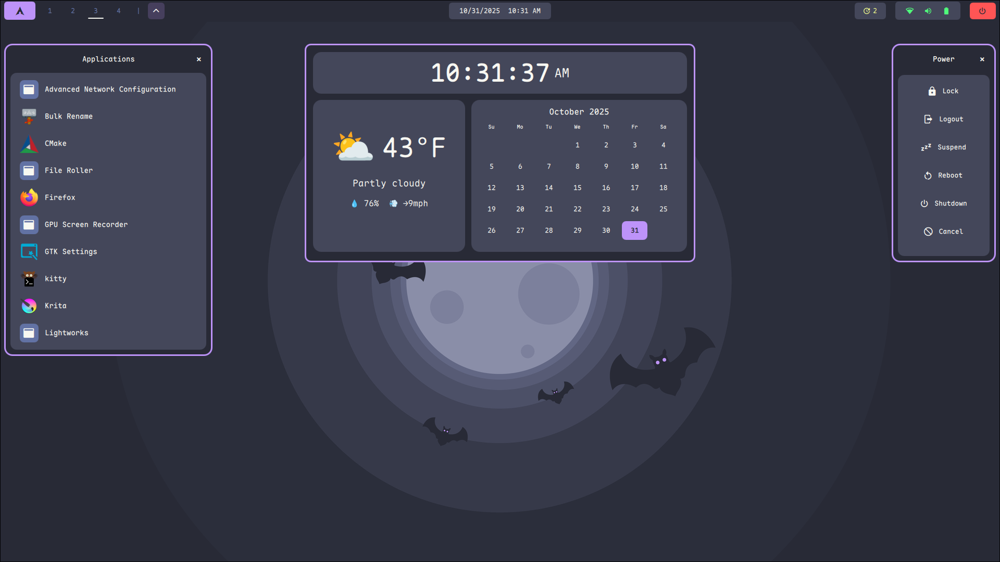
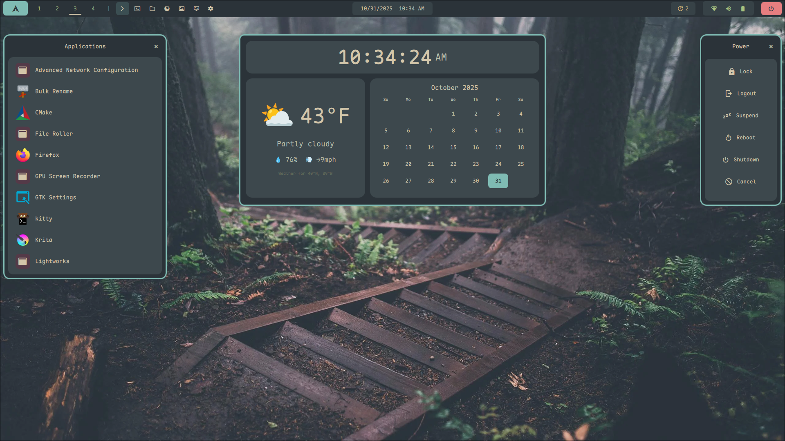
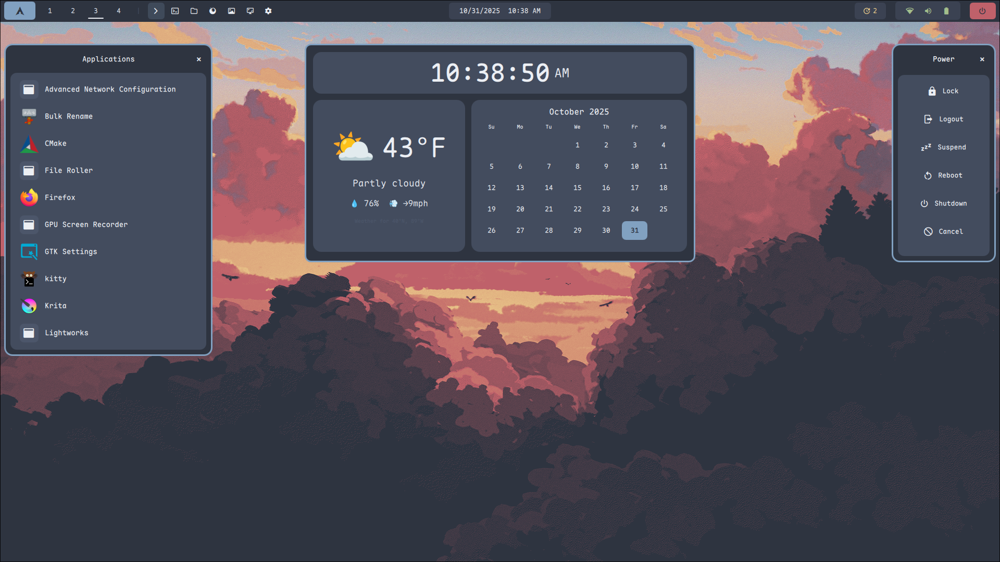
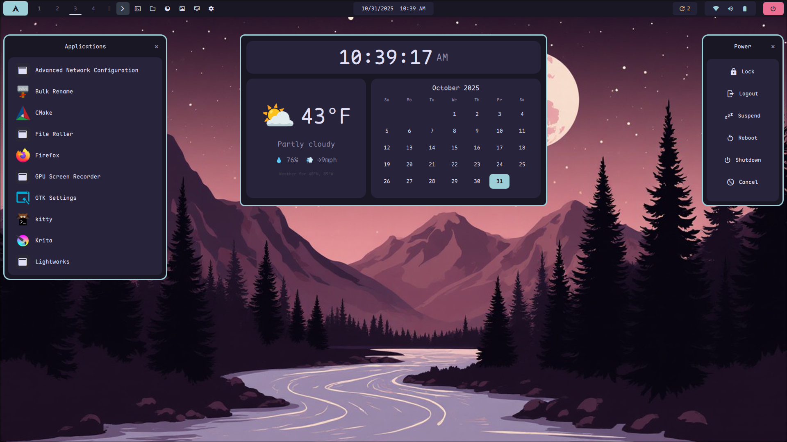

# YAHR - Yet Another Hyprland Rice 🍚

Complete Arch Linux + Hyprland desktop configuration with unified theme system.


## Features
- 🎨 11 beautiful themes with instant switching
- 🖥️ Quickshell desktop environment
- ⚡ Synced themes across all apps
- 📦 Ready to use configurations
- 🎭 Includes GTK themes and icon packs

## Installation

```bash
git clone https://github.com/bgibson72/yahr-quickshell.git
cd yahr-quickshell

# Backup existing configs (recommended)
mkdir -p ~/config-backup
cp -r ~/.config/{hypr,kitty,quickshell} ~/config-backup/ 2>/dev/null || true

# Install configurations
cp -r hypr kitty mako nvim quickshell vesktop VSCodium ~/.config/
```

## Included Applications

- **hypr** - Hyprland window manager with 11 theme definitions
- **quickshell** - Custom desktop environment (bar, widgets, controls)
- **kitty** - Terminal emulator with theme synchronization
- **mako** - Notification daemon with themed styling
- **nvim** - Neovim with AstroNvim configuration
- **VSCodium** - VS Code fork with theme integration
- **vesktop** - Discord client with theme support

## Key Features

### Unified Theme System
Switch themes instantly across all applications with Super + T. Available themes:
- Material (Palenight)


- Catppuccin (Mocha)


- Dracula



- Eldritch


- Everforest



- Gruvbox


- Kanagawa


- NightFox


- Nord



- Rosé Pine



- TokyoNight


### Custom Widgets
- **App Launcher** - Super + A - Fuzzy search application launcher


- **Calendar** - Super + C - Monthly calendar widget


- **Power Menu** - Super + Escape - System controls


- **Screenshot Tool** - Super + PrtScrn - Multi-mode screenshots


- **Settings** - Super + Shift + S - Quickshell configuration panel


- **Theme Switcher** - Super + T - Visual theme selector


- **Wallpaper Picker** - Super + Shift + W - Browse and select wallpapers


### System Integration
- Workspace management with visual indicators
- System tray with audio, network, and updates
- Notification system with urgency-based styling
- GTK theme synchronization
- **Included GTK themes and icons** - Multiple theme-matched GTK themes and icon packs included in quickshell/gtk-themes/ and quickshell/gtk-icons/

## Requirements

### Core Dependencies
```bash
sudo pacman -S hyprland quickshell kitty mako swww hyprpolkitagent
```

### Fonts (for consistent appearance)
```bash
yay -S ttf-maple nerd-fonts-symbols-common
```

### Optional Applications
```bash
yay -S vesktop-bin vscodium-bin
```

## Documentation

- [Quickshell Configuration Guide](quickshell/README.md)
- [Hyprland Setup](hypr/)
- [Theme Customization](quickshell/README.md#customization)

## Contributing

Contributions, issues, and feature requests are welcome!

## Credits & Inspiration

### Core Technologies
- [Quickshell](https://github.com/outfoxxed/quickshell) by outfoxxed - Desktop environment framework
- [Hyprland](https://hyprland.org/) by [Vaxry](https://github.com/vaxerski) - Dynamic tiling Wayland compositor

### GTK Themes & Icons
- [Fausto Korpsvart](https://github.com/Fausto-Korpsvart) - GTK themes and icon packs
- [Dracula GTK](https://github.com/dracula/gtk) by [Eliver Lara](https://github.com/EliverLara) - Dracula theme

### Inspired By
- [HyDE Project](https://github.com/prasanthrangan/hyprdots) - Hyprland configuration
- [JaKooLit](https://github.com/JaKooLit) - Hyprland configuration
- [Stephan Raabe's ML4W](https://www.ml4w.com) - Hyprland configuration
- [end-4](https://github.com/end-4) - quickshell, ags and desktop concepts
- [Matt-FTW](https://github.com/Matt-FTW) - quickshell and hyprland configuration
- [Caelestia-dots](https://github.com/Heus-Sueh/Caelestia-dots) - Beautiful quickshell configuration
- And many others in the r/unixporn and Hyprland communities

---

**Made with ❤️ for the Arch + Hyprland community**
